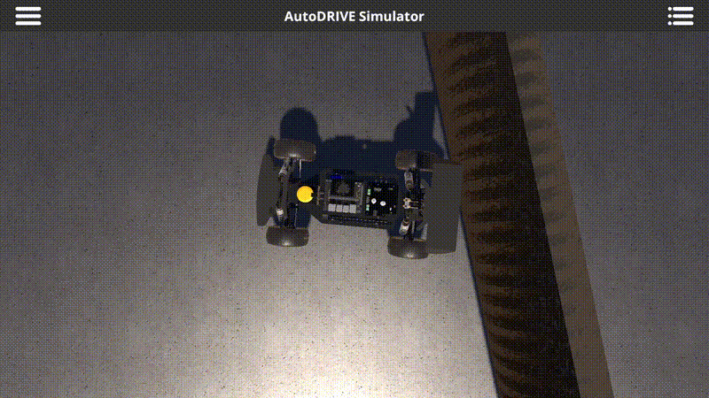

# AEB F110 🚗💨


Safety and autonomous driving stack for the F1TENTH platform on the AutoDRIVE simulator. The system provides Automatic Emergency Braking (AEB) via iTTC and supports both autonomous straight-line driving and manual teleoperation, with a keyboard-driven multiplexer to switch between sources at runtime.

---



---

## 📋 Table of Contents

- [Step 1 — Prerequisites](#step-1-prerequisites)
- [Step 2 — Installation](#step-2-installation)
- [Step 3 — Usage](#step-3-usage)
- [How it works](#how-it-works)
- [Project structure](#project-structure)
- [Parameters](#parameters)
- [ROS 2 Interface](#ros-2-interface)
- [Contact](#contact)

---

## Step 1. Prerequisites 📦

- **[Ubuntu 22.04](https://releases.ubuntu.com/22.04/)**
- **[ROS 2 Humble](https://docs.ros.org/en/humble/)** sourced (`/opt/ros/humble/setup.bash`)
- **AutoDRIVE DevKit** workspace (`~/autodrive_ws`) set up and built — see [AutoDRIVE_DevKit_Starter](https://github.com/hector-la/AutoDRIVE_DevKit_Starter/tree/main)
- Python virtual environment at `~/autodrive_ws/venv/`

---

## Step 2. Installation ⚙️

Clone this package into the AutoDRIVE workspace source directory and build it:

```bash
cd ~/autodrive_ws/src
git clone https://github.com/Raulvillaes/AIROS-AutoDRIVE-F110-AEB aeb_f110

cd ~/autodrive_ws
source /opt/ros/humble/setup.bash
source venv/bin/activate
colcon build --packages-select aeb_f110
```

---

## Step 3. Usage 🚀

First, **open the AutoDRIVE Simulator** application. Then open the following terminals from `~/autodrive_ws`.

### Terminal 1 — Simulator bridge

```bash
source /opt/ros/humble/setup.bash
source venv/bin/activate
export PYTHONPATH=~/autodrive_ws/venv/lib/python3.10/site-packages:$PYTHONPATH
source install/setup.bash
ros2 launch autodrive_f1tenth simulator_bringup_rviz.launch.py
```

> For a headless run replace the last line with:
> `ros2 launch autodrive_f1tenth simulator_bringup_headless.launch.py`

### Terminal 2 — AEB + multiplexer + linear driver

```bash
source /opt/ros/humble/setup.bash
source venv/bin/activate && source install/setup.bash
ros2 launch aeb_f110 auto.launch.py
```

The vehicle starts driving autonomously in a straight line. AEB is active from this point.

### Terminals 3 & 4 — Mode switcher + Teleop keyboard (optional)

Only needed if you want to switch between autonomous and manual mode at runtime. Run each in its own terminal and press `[T]` in the mode switcher to hand control to the teleop.

**Terminal 3 — Mode switcher**

```bash
source /opt/ros/humble/setup.bash
source venv/bin/activate && source install/setup.bash
ros2 run aeb_f110 mode_switcher_node
```

```
---------------------------------------
AEB F110 - Mode Switcher
---------------------------------------

A : Switch to AUTO  (linear driver)
T : Switch to TELEOP

Press CTRL+C to quit
---------------------------------------
```

**Terminal 4 — Teleop keyboard**

```bash
source /opt/ros/humble/setup.bash
source venv/bin/activate && source install/setup.bash
ros2 run autodrive_f1tenth teleop_keyboard --ros-args \
  -r /autodrive/f1tenth_1/throttle_command:=/aeb_f110/sources/teleop/throttle \
  -r /autodrive/f1tenth_1/steering_command:=/aeb_f110/sources/teleop/steering
```

---

## ⚙️ How it works

### Architecture

```
[linear_driver_node] → /aeb_f110/sources/auto/*   ─→┐
                                                      │  [mux_node]  ←  [mode_switcher_node]
[teleop_keyboard]    → /aeb_f110/sources/teleop/* ─→┘       │
                                                             ↓
                                              /aeb_f110/throttle_request
                                              /aeb_f110/steering_request
                                                             │
                                                       [aeb_node]
                                                             │
                                              /autodrive/f1tenth_1/throttle_command
                                              /autodrive/f1tenth_1/steering_command
                                                             │
                                                        [simulator]
```

The **mux node** is the single publisher to the AEB input topics. It selects which source's commands to forward based on the active source, and zeros the throttle if the active source stops publishing (watchdog). The **AEB node** is the final safety gate — no source can bypass it.

### Speed estimation

The AEB node subscribes to both wheel encoders (`left_encoder`, `right_encoder`) and differentiates the angular position over time to obtain a per-wheel linear speed. The longitudinal speed estimate is the average of both wheels.

### iTTC computation

On every LiDAR scan the AEB node:

1. **Filters invalid readings** — discards `inf`, `NaN`, and ranges outside `[range_min_cutoff, range_max]`.
2. **Applies an angular window** — keeps only the beams within ±`angular_window_deg` of the forward direction.
3. **Computes the instantaneous Time-To-Collision (iTTC)** for each remaining beam:

   ```
   range_rate_i = v · cos(θᵢ)
   TTC_i        = rᵢ / range_rate_i   (only where range_rate_i > 0.7)
   ```

4. **Triggers braking** if `min(TTC) < ttc_threshold`.

### State machine

| State | Behaviour |
|---|---|
| `NORMAL` | Throttle commands pass through unchanged |
| `BRAKING` | Throttle is overridden to `brake_command` (0.0) regardless of source input |

The latch is released **only** when the active source sends a negative throttle (reverse), ensuring deliberate intent to resume.

---

## 📁 Project structure

```
aeb_f110/
├── aeb_f110/
│   ├── __init__.py
│   ├── aeb_node.py             # AEB safety node (iTTC + brake latch)
│   ├── mux_node.py             # Command multiplexer (source arbitration + watchdog)
│   ├── linear_driver_node.py   # Autonomous straight-line driver
│   └── mode_switcher_node.py   # Keyboard interface to switch active source
├── launch/
│   └── auto.launch.py          # Launches AEB + mux + linear driver
├── resource/
│   └── aeb_f110
├── demo.gif
├── package.xml
├── setup.cfg
└── setup.py
```

---

## 🔧 Parameters

### `aeb_node`

All parameters can be tuned in [`launch/auto.launch.py`](launch/auto.launch.py).

| Parameter | Default | Description |
|---|---|---|
| `wheel_radius` | `0.058` m | F1TENTH simulated wheel radius |
| `ttc_threshold` | `0.66` s | Minimum TTC before braking is triggered |
| `range_min_cutoff` | `0.13` m | Minimum valid LiDAR range (filters close-range noise) |
| `angular_window_deg` | `12.5` ° | Half-width of the forward sector used for TTC evaluation |
| `brake_command` | `0.0` | Throttle value applied while the brake latch is active |
| `min_speed` | `0.8` m/s | Minimum speed below which AEB does not engage |

### `linear_driver_node`

| Parameter | Default | Description |
|---|---|---|
| `throttle` | `0.3` | Forward throttle value `[0.0, 1.0]` |
| `steering` | `0.0` | Steering angle (0.0 = straight) |
| `publish_rate` | `20.0` Hz | Command publish frequency |

### `mux_node`

| Parameter | Default | Description |
|---|---|---|
| `active_source` | `'auto'` | Source active at startup (`'auto'` or `'teleop'`) |
| `source_timeout` | `0.5` s | Time without messages before watchdog zeros throttle |

---

## 🔌 ROS 2 Interface

### `aeb_node`

| Direction | Topic | Type | Description |
|---|---|---|---|
| Sub | `/autodrive/f1tenth_1/lidar` | `sensor_msgs/LaserScan` | LiDAR scan |
| Sub | `/autodrive/f1tenth_1/left_encoder` | `sensor_msgs/JointState` | Left wheel encoder |
| Sub | `/autodrive/f1tenth_1/right_encoder` | `sensor_msgs/JointState` | Right wheel encoder |
| Sub | `/aeb_f110/throttle_request` | `std_msgs/Float32` | Throttle request from mux |
| Sub | `/aeb_f110/steering_request` | `std_msgs/Float32` | Steering request from mux |
| Pub | `/autodrive/f1tenth_1/throttle_command` | `std_msgs/Float32` | Throttle sent to simulator (may be overridden) |
| Pub | `/autodrive/f1tenth_1/steering_command` | `std_msgs/Float32` | Steering sent to simulator (always passed through) |

### `mux_node`

| Direction | Topic | Type | Description |
|---|---|---|---|
| Sub | `/aeb_f110/sources/auto/throttle` | `std_msgs/Float32` | Throttle from linear driver |
| Sub | `/aeb_f110/sources/auto/steering` | `std_msgs/Float32` | Steering from linear driver |
| Sub | `/aeb_f110/sources/teleop/throttle` | `std_msgs/Float32` | Throttle from teleop |
| Sub | `/aeb_f110/sources/teleop/steering` | `std_msgs/Float32` | Steering from teleop |
| Sub | `/aeb_f110/mux/active_source` | `std_msgs/String` | Runtime source selection |
| Pub | `/aeb_f110/throttle_request` | `std_msgs/Float32` | Selected throttle forwarded to AEB |
| Pub | `/aeb_f110/steering_request` | `std_msgs/Float32` | Selected steering forwarded to AEB |

### `linear_driver_node`

| Direction | Topic | Type | Description |
|---|---|---|---|
| Pub | `/aeb_f110/sources/auto/throttle` | `std_msgs/Float32` | Constant forward throttle |
| Pub | `/aeb_f110/sources/auto/steering` | `std_msgs/Float32` | Constant steering (0.0) |

### `mode_switcher_node`

| Direction | Topic | Type | Description |
|---|---|---|---|
| Pub | `/aeb_f110/mux/active_source` | `std_msgs/String` | Source selection command (`'auto'` / `'teleop'`) |

---

## 📬 Contact

This project was developed as part of **AIROS – ESPOL**.

**Raúl Villavicencio**
GitHub: [https://github.com/Raulvillaes](https://github.com/Raulvillaes)

**Micaela Anamise**
GitHub: [https://github.com/carolinanamise13-hub](https://github.com/carolinanamise13-hub)

---

*AIROS – ESPOL*
